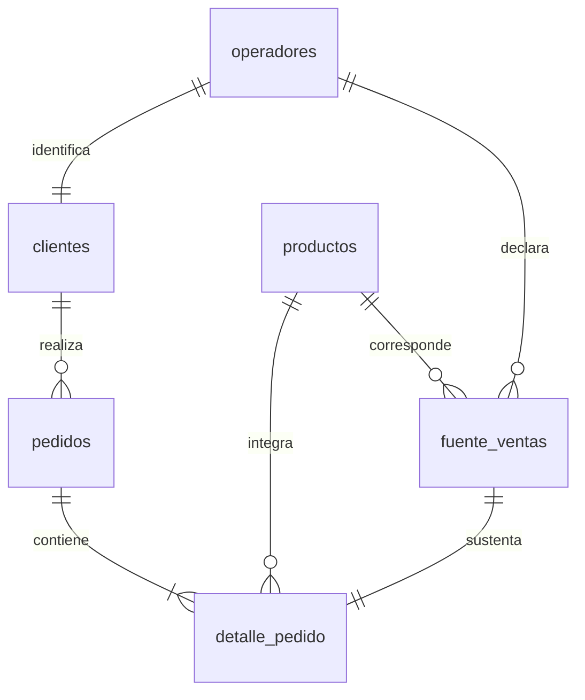

# Análisis de combustibles con PostgreSQL

Proyecto final Coderhouse. **Mayorista ficticio que abastece a establecimientos reales.** El Gobierno publica los datos utilizados; no participa como vendedor en el caso.

Los establecimientos seleccionados son nuestros clientes dentro de la simulación. Sus identidades, productos, volúmenes mensuales y precios proceden de datos públicos. Su relación con nuestro mayorista, los pedidos y el estado `Concretado` son supuestos educativos. Los precios originales se conservan como **referencias minoristas con impuestos**, no como precios mayoristas observados.

Estado: modelo preparado y verificado técnicamente. Pendientes carga desde cero y nuevas capturas en el PostgreSQL del usuario, y análisis de negocio conjunto. No se conservan carpetas ni evidencias del enfoque descartado.

## 1. Definición del problema

Un mayorista ficticio necesita identificar sus principales cuentas, la evolución mensual de los importes y la composición por productos para orientar el seguimiento comercial. Se construye una cartera de 18 establecimientos y un pedido por cliente y mes de 2025.

| Pregunta | Métrica y criterio |
| --- | --- |
| ¿Cuáles son los cinco clientes con mayor gasto de referencia? | Suma de cantidad × precio de referencia por establecimiento cliente. |
| ¿Cómo evolucionan las ventas mensuales simuladas? | Importe de referencia por mes. |
| ¿Cuáles son los tres productos menos vendidos? | Volumen en litros entre seis combustibles líquidos; GNC aparte. |
| ¿Qué pedidos tienen mayor importe dentro de cada categoría? | Importe del pedido en cada categoría; `RANK()` por categoría. |
| ¿Qué porcentaje del importe concentran los cinco principales clientes? | Importe top 5 / importe total × 100. |
| ¿Cómo evoluciona el precio ponderado de cada producto? | SUM(cantidad × precio) / SUM(cantidad), por producto y mes. |

Las seis preguntas cubren las cinco solicitadas por la actividad y los cuatro análisis enumerados por el entregable, que pide resolver al menos tres. No se inventan resultados ni explicaciones causales antes de revisar cada consulta.

### Fuente y supuestos

Fuente pública: [Precios y volúmenes EESS, Resolución 1104/04](https://datos.gob.ar/ar/dataset/energia-precios-volumenes-eess---resolucion-110404). Archivo `precios_eess_2025_en_adelante.accdb`, tabla `public_vi_access_eess_2025_en_adelante`. El artículo 9 de la [normativa](https://www.argentina.gob.ar/normativa/nacional/norma-100848/actualizacion) describe ventas por boca de expendio. Nuestra selección corresponde al canal `Al público`, no a compras a distribuidores. El archivo mayorista aportado inicialmente no se utiliza.

Muestra intencional de 2025: 18 establecimientos, tres en cada provincia de Buenos Aires, Chaco, Córdoba, Corrientes, Misiones y Santa Fe. Se conservan 1.013 filas originales y se incluyen 1.007 tras excluir seis de otros canales. No representa todo el mercado argentino.

Supuestos aprobados:

- Cada establecimiento constituye una cuenta cliente; un CUIT no identifica por sí solo un establecimiento.
- Un pedido mensual por establecimiento. La fecha se representa con el primer día del mes, no con una fecha de entrega conocida.
- Cantidad comprada simulada = volumen vendido al público declarado por el establecimiento en ese mes. Se omiten variaciones de existencias.
- Se conserva el precio promedio mensual minorista con impuestos como referencia del ejercicio. No se inventan descuentos ni márgenes mayoristas.
- No hay compradores ficticios adicionales, segmentos inventados ni reparto aleatorio de cantidades.

Los importes son ARS nominales de referencia: no facturación mayorista real, rentabilidad ni crecimiento ajustado por inflación. Doce pedidos por cliente son una regla del modelo y no una medida de fidelidad.

### Unidades

Líquidos: volumen original en m³ × 1.000 = litros; precio en ARS/L. GNC: m³ y ARS/m³. No sumar litros y m³ como una cantidad única. Los importes sí se pueden sumar por estar expresados en ARS bajo el mismo criterio.

## 2. Preparación y carga

Base requerida: `capstone_project`. Esquema actual: `combustibles`.

| Tabla | Función | Filas |
| --- | --- | ---: |
| operadores | Identidad original de cada establecimiento | 18 |
| clientes | Cuentas del mayorista, una por establecimiento | 18 |
| productos | Productos, categorías y unidades | 7 |
| pedidos | Un pedido mensual por cliente | 216 |
| detalle_pedido | Un detalle por registro fuente incluido | 1.007 |
| fuente_ventas | Ventas al público originales utilizadas como referencia | 1.007 |
| detalle_pedido_entrada | Detalles con incidencias didácticas | 1.010 |

`clientes.id_operador` es único y referencia a `operadores`. No representa un proveedor: relaciona la cuenta comercial con su identidad de origen. `pedidos` referencia al cliente sin duplicar `id_operador`. Los detalles enlazan pedido, producto y registro fuente. Hay claves primarias/foráneas, restricciones de valores positivos, `DATE`, `NUMERIC` y unicidad cliente/mes.



### Carga nueva

1. Crear una base vacía llamada `capstone_project` en pgAdmin y conectarse a ella.
2. Abrir y ejecutar completo [estructura.sql](estructura.sql). Incluye creación, INSERT, limpieza y vistas en una transacción; no requiere importar CSV.
3. Ejecutar los bloques de [validaciones.sql](validaciones.sql) y comparar los resultados con este README.
4. Ejecutar la primera consulta de [analisis.sql](analisis.sql) cuando se haya comprobado la carga.

Con psql, desde la raíz del repositorio y con una base vacía creada: `psql -d capstone_project -v ON_ERROR_STOP=1 -f estructura.sql`.

### Reemplazo de la carga existente

La base del usuario ya está confirmada: `capstone_project`. Se acordó reemplazar el enfoque anterior desde cero, sin conservar un esquema de respaldo.

1. Conectarse a `capstone_project` en pgAdmin.
2. Ejecutar [reiniciar_esquema.sql](reiniciar_esquema.sql). El script comprueba el nombre de la base y elimina únicamente los esquemas del proyecto `combustibles` y `combustibles_v1`, con sus objetos. No elimina la base ni otros esquemas.
3. Ejecutar completo `estructura.sql` para cargar el modelo actual.
4. Ejecutar `validaciones.sql` por bloques y obtener las nuevas capturas.

El reinicio elimina los datos existentes en esos esquemas. No ejecutarlo después de la carga nueva salvo que se quiera repetirla desde cero. `estructura.sql` por sí solo no borra una carga existente.

### Evidencia pendiente de reemplazo

Las imágenes del enfoque descartado se retiraron. Las nuevas deben salir de la ejecución real del usuario en pgAdmin; no se fabrican capturas.

| Paso | Nueva imagen prevista | Resultado esperado |
| --- | --- | --- |
| 2. Preparación y carga | `imagenes/conteos_tablas.png` | Los siete conteos de la tabla anterior |
| 3. Limpieza | `imagenes/limpieza.png` | Entrada: 1.010 filas, 3 repeticiones y 8 precios nulos; salida: 1.007, 0 y 0 |
| 3. Conciliación | `imagenes/conciliacion.png` | 1.007 registros comprobados y 0 con diferencias |

Estos nombres son destinos previstos; las imágenes todavía no están incorporadas. También verificar fechas, pedidos mensuales, trazabilidad y tipos con los demás bloques de `validaciones.sql`. Si una captura muestra el nombre de la base, debe ser `capstone_project`.

## 3. Limpieza y transformación

Las incidencias se introducen exclusivamente en `detalle_pedido_entrada`, no en la fuente real: 8 precios nulos y 3 duplicados exactos. En la entrada ninguno de los duplicados repite un precio nulo.

| Etapa | Filas | Repeticiones de identificador | Precios nulos |
| --- | ---: | ---: | ---: |
| Entrada actual | 1.010 | 3 | 8 |
| Detalle limpio actual | 1.007 | 0 | 0 |

La carga aplica:

```sql
INSERT INTO combustibles.detalle_pedido
SELECT DISTINCT
    e.id_detalle, e.id_pedido, e.id_producto, e.id_fuente,
    e.cantidad,
    COALESCE(e.precio_unitario_ars, f.precio_promedio_con_impuestos_ars),
    e.origen
FROM combustibles.detalle_pedido_entrada e
JOIN combustibles.fuente_ventas f ON f.id_fuente = e.id_fuente;
```

Este bloque ya está incluido en `estructura.sql`. No ejecutarlo nuevamente sobre el detalle cargado. El precio se recupera del mismo registro fuente porque por diseño es el precio de referencia asignado al pedido; no se rellena con cero ni con un promedio arbitrario.

Los períodos de origen están completos. No se inventan nulos de fecha: se transforman a `DATE` usando el primer día del mes y se verifica que sean doce meses de 2025, sin fechas nulas ni días distintos de 1. Cantidades y precios se definen como `NUMERIC(18,3)` y `NUMERIC(18,2)`.

### Conciliación y relaciones

`v_conciliacion` debe comprobar 1.007 registros fuente con cero diferencias de cantidad e importe. Totales conservados: **93.213.130 L**, **8.638.800,20 m³ de GNC** e **importe de referencia 141.717.574.607,79 ARS**.

`validaciones.sql` comprueba además un pedido por cliente/mes, doce pedidos por cliente, tipos de datos y 1.007 filas después de los JOIN, con cero inconsistencias de establecimiento, producto y período. Esto controla la multiplicación accidental de filas.

Validaciones técnicas del modelo: [Python Decimal](datos/validacion.json) y [PostgreSQL mediante PGlite](datos/validacion_postgresql.json). El reporte conserva los resultados técnicos de la carga del modelo actual. No sustituye las nuevas capturas del usuario en pgAdmin, todavía pendientes.

## 4. Análisis — en desarrollo

`analisis.sql` contiene la primera consulta adaptada a clientes con identidad real. Devuelve identificador, nombre, localidad, provincia, doce pedidos y gasto de referencia. La cantidad de pedidos es constante por diseño; la diferencia entre clientes procede de cantidades y precios/productos de referencia.

Falta ejecutar/revisar el resultado actual con el usuario y desarrollar las otras cinco consultas de forma gradual. La verificación técnica no se presenta como análisis de negocio completado.

Para cada consulta se documentarán pregunta, métrica, filtros, resultado, interpretación, limitación y evidencia.

## 5. Comunicación de hallazgos — pendiente

Al revisar cada consulta se incorporará su interpretación. Al finalizar se sintetizarán hallazgos y posibles decisiones para el mayorista ficticio. No se extrapolarán las cifras al país ni se interpretarán como compras reales de estaciones, precios mayoristas, márgenes o fidelidad.

## Archivos y reproducción

- `estructura.sql`: definición, carga, limpieza y vistas del modelo actual.
- `reiniciar_esquema.sql`: reinicio de los esquemas del proyecto en `capstone_project` para una carga desde cero.
- `validaciones.sql`: conteos, limpieza, conciliación, fechas y relaciones.
- `analisis.sql`: primera consulta; desarrollo gradual de las restantes.
- [datos/README.md](datos/README.md): selección y metodología.
- [datos/diccionario.md](datos/diccionario.md): campos, relaciones y unidades.
- `datos/generar_dataset.py`: regeneración determinista con Python 3.10+, sin dependencias externas.
- `datos/sha256_csv.json`: huellas de integridad de todos los CSV.
- [PROJECT_STATE.md](PROJECT_STATE.md): decisiones y continuidad.

Ejecutar desde la raíz `python3 datos/generar_dataset.py`. Usa `datos/fuente_original.csv` y reemplaza derivados y `estructura.sql`. No descarga novedades ni repite la selección desde Access. La validación PostgreSQL se ejecuta por separado; no la genera Python.

La publicación de nombres y CUIT de los operadores de la fuente pública fue autorizada por el usuario el 21/09/2026. Se conserva atribución y no se asigna una licencia nueva a los datos de terceros.
