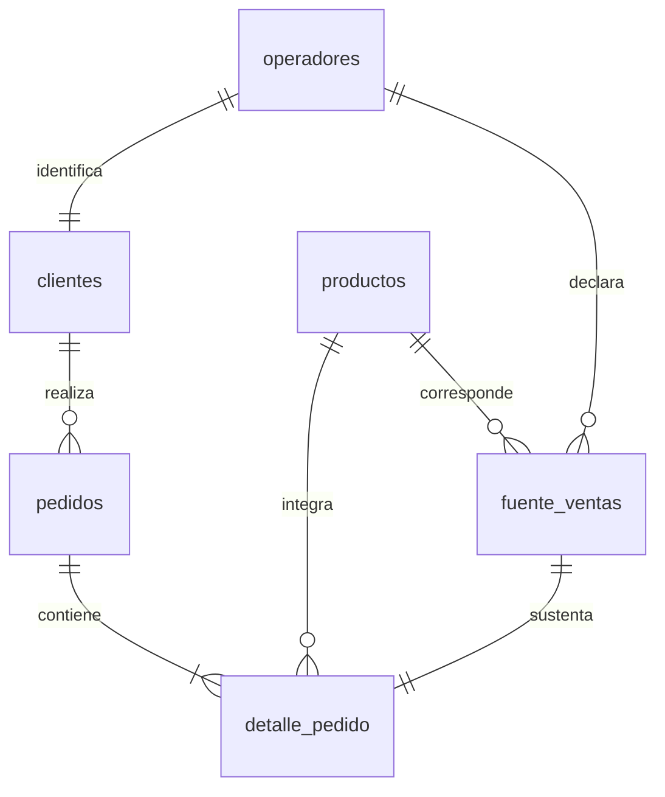

# Análisis de combustibles con PostgreSQL

Desarrollo este proyecto final de Coderhouse para analizar una cartera de clientes de un **distribuidor mayorista ficticio de combustibles**. Utilizo datos públicos de establecimientos reales y construyo un modelo relacional en PostgreSQL para estudiar los importes de venta simulados, la evolución mensual y la composición por productos.

Trabajo con 18 establecimientos de seis provincias, siete productos y los doce meses de 2025. Cada establecimiento representa un cliente del mayorista y tiene un pedido mensual. Distingo los datos de origen de los supuestos comerciales para que los resultados puedan interpretarse dentro del alcance del ejercicio.

## 1. Problema de negocio y alcance

Mi objetivo es identificar las cuentas con mayor peso comercial y comprender cómo se distribuyen los volúmenes y los importes de referencia. Planteo estas preguntas:

| Pregunta | Métrica y criterio |
| --- | --- |
| ¿Cuáles son los cinco clientes con mayor gasto de referencia? | Suma de cantidad × precio de referencia por establecimiento. |
| ¿Cómo evolucionan las ventas mensuales simuladas? | Importe de referencia agrupado por mes. |
| ¿Cuáles son los tres productos menos vendidos? | Volumen en litros entre los seis combustibles líquidos; GNC por separado. |
| ¿Qué pedidos tienen mayor importe dentro de cada categoría? | Importe del pedido por categoría y posición mediante `RANK()`. |
| ¿Qué porcentaje del importe concentran los cinco principales clientes? | Importe del top 5 / importe total × 100. |
| ¿Cómo evoluciona el precio ponderado de cada producto? | `SUM(cantidad * precio) / SUM(cantidad)`, por producto y mes. |

### Fuente de datos

Utilizo el conjunto público [Precios y volúmenes EESS, Resolución 1104/04](https://datos.gob.ar/ar/dataset/energia-precios-volumenes-eess---resolucion-110404), a partir del archivo `precios_eess_2025_en_adelante.accdb` y su tabla `public_vi_access_eess_2025_en_adelante`.

Selecciono registros del canal **Al público**, que describen ventas de estaciones a consumidores. El Gobierno publica estos datos; la fuente no acredita compras de las estaciones a distribuidores. Por eso, la relación entre mi mayorista ficticio y sus clientes forma parte de la simulación.

Mi muestra incluye tres establecimientos de cada provincia: Buenos Aires, Chaco, Córdoba, Corrientes, Misiones y Santa Fe. Conservo 1.013 filas originales para mantener la trazabilidad y utilizo 1.007, tras excluir seis correspondientes a otros canales. La selección es intencional y no representa todo el mercado argentino.

### Supuestos del modelo

- Identifico cada cuenta cliente por establecimiento. Un mismo CUIT puede corresponder a más de una ubicación.
- Genero un pedido por cliente y mes. Represento el período con el primer día del mes, sin atribuirle una fecha real de entrega.
- Asigno como cantidad comprada simulada el volumen mensual vendido al público por ese establecimiento. No modelo variaciones de existencias.
- Conservo el precio promedio mensual minorista con impuestos como referencia. No aplico descuentos ni estimo márgenes mayoristas.
- Asigno el estado `Concretado` a todos los pedidos como supuesto del caso.

Los nombres, ubicaciones, productos, volúmenes y precios proceden de la fuente pública. Los pedidos y la relación comercial con el mayorista son simulados. Interpreto los importes como **ARS nominales de referencia**, sin atribuirles carácter de facturación mayorista real o rentabilidad. Los doce pedidos por cliente son una regla del modelo y no permiten medir fidelidad.

### Unidades

Convierto los volúmenes de combustibles líquidos de m³ a litros multiplicando por 1.000 y conservo sus precios en ARS/L. Para GNC mantengo m³ y ARS/m³.

Analizo los volúmenes de líquidos y GNC por separado. Puedo sumar sus importes porque están expresados en ARS bajo el mismo criterio de valoración.

## 2. Preparación y estructura de la base

Organizo los datos en la base `capstone_project`, dentro del esquema `combustibles`. Utilizo PostgreSQL para almacenar y consultar la información, y pgAdmin para ejecutar las consultas e inspeccionar los resultados.

| Tabla | Función | Filas |
| --- | --- | ---: |
| operadores | Identidad original de cada establecimiento | 18 |
| clientes | Cuenta comercial vinculada a un establecimiento | 18 |
| productos | Combustibles, categorías y unidades | 7 |
| pedidos | Cabecera del pedido mensual de cada cliente | 216 |
| detalle_pedido | Producto, cantidad y precio de cada línea | 1.007 |
| fuente_ventas | Registros originales utilizados como referencia | 1.007 |
| detalle_pedido_entrada | Entrada con incidencias didácticas para la limpieza | 1.010 |

Relaciono cada cliente con su establecimiento mediante `clientes.id_operador`, una clave foránea única. Vinculo los pedidos con los clientes y cada detalle con su pedido, producto y registro fuente. Así puedo rastrear el origen de las cantidades y los precios.



Defino claves primarias y foráneas, restricciones de valores positivos y unicidad de cliente y mes. Uso `DATE` para fechas, `NUMERIC(18,3)` para cantidades y `NUMERIC(18,2)` para precios.

### Comprobación de la carga

Para comprobar el número de registros de las siete tablas, utilizo esta consulta:

```sql
SELECT 'operadores' AS tabla, COUNT(*) AS filas FROM combustibles.operadores
UNION ALL SELECT 'productos', COUNT(*) FROM combustibles.productos
UNION ALL SELECT 'clientes', COUNT(*) FROM combustibles.clientes
UNION ALL SELECT 'pedidos', COUNT(*) FROM combustibles.pedidos
UNION ALL SELECT 'detalle_pedido', COUNT(*) FROM combustibles.detalle_pedido
UNION ALL SELECT 'fuente_ventas', COUNT(*) FROM combustibles.fuente_ventas
UNION ALL SELECT 'detalle_pedido_entrada', COUNT(*) FROM combustibles.detalle_pedido_entrada;
```


Obtengo los siete conteos previstos: 18 operadores, 7 productos, 18 clientes, 216 pedidos, 1.007 detalles, 1.007 registros fuente y 1.010 filas de entrada.

## 3. Limpieza y transformación

Introduzco ocho precios nulos y tres duplicados exactos exclusivamente en `detalle_pedido_entrada` para demostrar el tratamiento de estas incidencias. Mantengo intacta la fuente real y registro las alteraciones en `datos/incidencias_simuladas.csv`.

### Tratamiento de duplicados y precios nulos

Utilizo `DISTINCT` para eliminar las copias idénticas y `COALESCE` para recuperar cada precio faltante desde su registro fuente:

```sql
INSERT INTO combustibles.detalle_pedido
SELECT DISTINCT
    e.id_detalle, e.id_pedido, e.id_producto, e.id_fuente,
    e.cantidad,
    COALESCE(e.precio_unitario_ars, f.precio_promedio_con_impuestos_ars),
    e.origen
FROM combustibles.detalle_pedido_entrada e
JOIN combustibles.fuente_ventas f ON f.id_fuente = e.id_fuente;
```

Recupero el precio del mismo registro porque es la referencia asignada al pedido por diseño. Esto evita introducir un cero o un promedio ajeno a la operación. Incluyo esta transformación en la carga inicial.

Para comparar la entrada con el detalle limpio, ejecuto:

```sql
SELECT
    'Entrada antes de limpiar' AS etapa,
    COUNT(*) AS filas,
    COUNT(*) - COUNT(DISTINCT id_detalle) AS filas_repetidas,
    COUNT(*) FILTER (WHERE precio_unitario_ars IS NULL) AS precios_nulos
FROM combustibles.detalle_pedido_entrada
UNION ALL
SELECT
    'Detalle limpio',
    COUNT(*),
    COUNT(*) - COUNT(DISTINCT id_detalle),
    COUNT(*) FILTER (WHERE precio_unitario_ars IS NULL)
FROM combustibles.detalle_pedido;
```


| Etapa | Filas | Repeticiones de identificador | Precios nulos |
| --- | ---: | ---: | ---: |
| Entrada antes de limpiar | 1.010 | 3 | 8 |
| Detalle limpio | 1.007 | 0 | 0 |

El resultado confirma que elimino las tres filas duplicadas y recupero los ocho precios faltantes, conservando los 1.007 detalles previstos.

### Fechas y precisión numérica

Transformo los períodos de origen al tipo `DATE` mediante el primer día del mes. Como los períodos de la muestra están completos, no imputo fechas.

Conservo tres decimales en las cantidades y dos en los precios. Calculo el importe como cantidad × precio y redondeo para su presentación, evitando introducir diferencias en la conciliación.

### Conciliación con la fuente

Comparo las cantidades y los importes de cada registro fuente con los de su detalle de pedido mediante la vista `v_conciliacion`. Compruebo las diferencias con esta consulta:

```sql
SELECT
    COUNT(*) AS registros_comprobados,
    COUNT(*) FILTER (
        WHERE diferencia_cantidad <> 0
           OR diferencia_importe_ars <> 0
    ) AS registros_con_diferencias
FROM combustibles.v_conciliacion;
```


Obtengo **1.007 registros comprobados y 0 con diferencias**. Esto confirma que la transformación conserva las cantidades y los importes de referencia de los registros incluidos.

Los totales del dataset son **93.213.130 litros de combustibles líquidos**, **8.638.800,20 m³ de GNC** y **141.717.574.607,79 ARS de referencia**. Mantengo separadas las dos unidades de volumen.

Complemento estos controles con comprobaciones de fechas, pedidos mensuales, claves y relaciones. Los reportes técnicos de [Python Decimal](datos/validacion.json) y [PostgreSQL mediante PGlite](datos/validacion_postgresql.json) registran sus resultados. Las capturas de esta sección muestran los controles de conteos, limpieza y conciliación ejecutados en pgAdmin.

## 4. Análisis de negocio

En [analisis.sql](analisis.sql) desarrollo las consultas para responder las preguntas del proyecto. La primera identifica los cinco establecimientos con mayor importe de referencia y devuelve cliente, localidad, provincia, cantidad de pedidos e importe acumulado.

Calculo el gasto de referencia como la suma de cantidad × precio y cuento los pedidos con `COUNT(DISTINCT id_pedido)` para evitar contar cada línea de producto como un pedido diferente.

**El análisis de negocio está en desarrollo.** Aún no presento resultados interpretados del top 5 ni conclusiones para las demás preguntas.

## 5. Límites de interpretación

Delimito las conclusiones a los establecimientos seleccionados y al período 2025. Considero el efecto conjunto de cantidades, precios y composición por productos al interpretar los importes.

No extrapolo la muestra al país ni interpreto una variación nominal como crecimiento real ajustado por inflación. Tampoco calculo rentabilidad, porque no dispongo de costos de compra del mayorista.

## Archivos y reproducción

| Archivo | Contenido |
| --- | --- |
| [estructura.sql](estructura.sql) | Tablas, inserciones, limpieza y vistas |
| [analisis.sql](analisis.sql) | Consultas de negocio comentadas |
| [validaciones.sql](validaciones.sql) | Consultas de control de carga, limpieza, conciliación y relaciones |
| [datos/README.md](datos/README.md) | Fuente, selección y metodología del dataset |
| [datos/diccionario.md](datos/diccionario.md) | Definición de campos, relaciones y unidades |
| [datos/generar_dataset.py](datos/generar_dataset.py) | Generación determinista de los datos derivados |
| [datos/sha256_csv.json](datos/sha256_csv.json) | Huellas de integridad de los CSV |
| [imagenes/](imagenes/) | Resultados de las consultas en pgAdmin |

Para reproducir la base, utilizo una base vacía llamada `capstone_project` y ejecuto completo `estructura.sql`. El archivo contiene las inserciones y la limpieza en una transacción, por lo que no requiere importar los CSV por separado. Desde la raíz del repositorio, puedo cargarlo con:

```bash
psql -d capstone_project -v ON_ERROR_STOP=1 -f estructura.sql
```

Para regenerar los datos derivados, utilizo Python 3.10 o superior, sin dependencias externas:

```bash
python3 datos/generar_dataset.py
```

El generador utiliza la muestra congelada `datos/fuente_original.csv` y reemplaza los derivados y `estructura.sql`. No descarga novedades ni repite la selección desde Access. La validación PostgreSQL se realiza por separado.

Mantengo la atribución de la fuente pública y no asigno una licencia nueva a los datos de terceros.
