# Análisis de combustibles con PostgreSQL

Desarrollo este proyecto final de Coderhouse para analizar una cartera de clientes de un **distribuidor mayorista ficticio de combustibles**. Utilizo datos públicos de establecimientos reales y construyo un modelo relacional en PostgreSQL para estudiar los importes de venta simulados, la evolución mensual y la composición por productos.

Trabajo con 18 establecimientos de seis provincias, siete productos y los doce meses de 2025. Cada establecimiento representa un cliente del mayorista y tiene un pedido mensual. Distingo los datos de origen de los supuestos comerciales para que los resultados puedan interpretarse dentro del alcance del ejercicio.

## 1. Problema de negocio y alcance

Mi objetivo es identificar las cuentas con mayor peso comercial y comprender cómo se distribuyen los volúmenes y los importes de referencia. Planteo estas preguntas:

| Pregunta | Métrica y criterio |
| --- | --- |
| ¿Cuáles son los cinco clientes con mayor gasto de referencia? | Suma de cantidad × precio de referencia por establecimiento. |
| ¿Cómo evolucionan las ventas mensuales simuladas? | Importe de referencia agrupado por mes. |
| ¿Cuáles son los tres productos menos vendidos? | Volumen en litros entre los seis combustibles líquidos; GNC por separado. |
| ¿Qué pedidos tienen mayor importe dentro de cada categoría? | Importe del pedido por categoría y posición mediante `RANK()`. |
| ¿Qué porcentaje del importe concentran los cinco principales clientes? | Importe del top 5 / importe total × 100. |
| ¿Cómo evoluciona el precio ponderado de cada producto? | `SUM(cantidad * precio) / SUM(cantidad)`, por producto y mes. |

### Fuente de datos

Utilizo el conjunto público [Precios y volúmenes EESS, Resolución 1104/04](https://datos.gob.ar/ar/dataset/energia-precios-volumenes-eess---resolucion-110404), a partir del archivo `precios_eess_2025_en_adelante.accdb` y su tabla `public_vi_access_eess_2025_en_adelante`.

Selecciono registros del canal **Al público**, que describen ventas de estaciones a consumidores. El Gobierno publica estos datos; la fuente no acredita compras de las estaciones a distribuidores. Por eso, la relación entre mi mayorista ficticio y sus clientes forma parte de la simulación.

Mi muestra incluye tres establecimientos de cada provincia: Buenos Aires, Chaco, Córdoba, Corrientes, Misiones y Santa Fe. Conservo 1.013 filas originales para mantener la trazabilidad y utilizo 1.007, tras excluir seis correspondientes a otros canales. La selección es intencional y no representa todo el mercado argentino.

### Supuestos del modelo

- Identifico cada cuenta cliente por establecimiento. Un mismo CUIT puede corresponder a más de una ubicación.
- Genero un pedido por cliente y mes. Represento el período con el primer día del mes, sin atribuirle una fecha real de entrega.
- Asigno como cantidad comprada simulada el volumen mensual vendido al público por ese establecimiento. No modelo variaciones de existencias.
- Conservo el precio promedio mensual minorista con impuestos como referencia. No aplico descuentos ni estimo márgenes mayoristas.
- Asigno el estado `Concretado` a todos los pedidos como supuesto del caso.

Los nombres, ubicaciones, productos, volúmenes y precios proceden de la fuente pública. Los pedidos y la relación comercial con el mayorista son simulados. Interpreto los importes como **ARS nominales de referencia**, sin atribuirles carácter de facturación mayorista real o rentabilidad. Los doce pedidos por cliente son una regla del modelo y no permiten medir fidelidad.

### Unidades

Convierto los volúmenes de combustibles líquidos de m³ a litros multiplicando por 1.000 y conservo sus precios en ARS/L. Para GNC mantengo m³ y ARS/m³.

Analizo los volúmenes de líquidos y GNC por separado. Puedo sumar sus importes porque están expresados en ARS bajo el mismo criterio de valoración.

## 2. Preparación y estructura de la base

Organizo los datos en la base `capstone_project`, dentro del esquema `combustibles`. Utilizo PostgreSQL para almacenar y consultar la información, y pgAdmin para ejecutar las consultas e inspeccionar los resultados.

| Tabla | Función | Filas |
| --- | --- | ---: |
| operadores | Identidad original de cada establecimiento | 18 |
| clientes | Cuenta comercial vinculada a un establecimiento | 18 |
| productos | Combustibles, categorías y unidades | 7 |
| pedidos | Cabecera del pedido mensual de cada cliente | 216 |
| detalle_pedido | Producto, cantidad y precio de cada línea | 1.007 |
| fuente_ventas | Registros originales utilizados como referencia | 1.007 |
| detalle_pedido_entrada | Entrada con incidencias didácticas para la limpieza | 1.010 |

Relaciono cada cliente con su establecimiento mediante `clientes.id_operador`, una clave foránea única. Vinculo los pedidos con los clientes y cada detalle con su pedido, producto y registro fuente. Así puedo rastrear el origen de las cantidades y los precios.

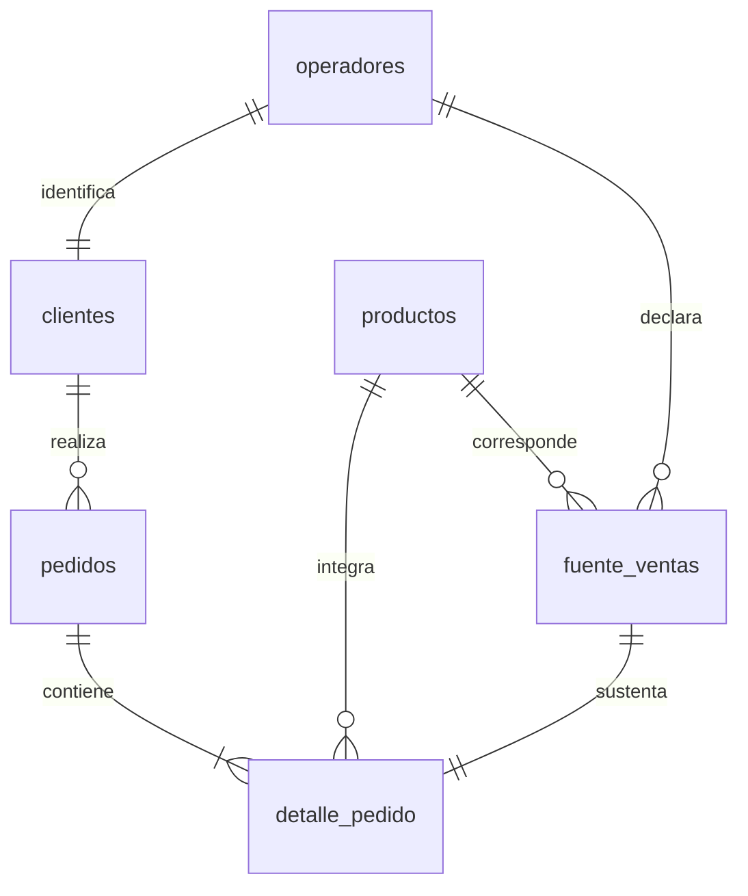

Defino claves primarias y foráneas, restricciones de valores positivos y unicidad de cliente y mes. Uso `DATE` para fechas, `NUMERIC(18,3)` para cantidades y `NUMERIC(18,2)` para precios.

### Comprobación de la carga

Para comprobar el número de registros de las siete tablas, utilizo esta consulta:

```sql
SELECT 'operadores' AS tabla, COUNT(*) AS filas FROM combustibles.operadores
UNION ALL SELECT 'productos', COUNT(*) FROM combustibles.productos
UNION ALL SELECT 'clientes', COUNT(*) FROM combustibles.clientes
UNION ALL SELECT 'pedidos', COUNT(*) FROM combustibles.pedidos
UNION ALL SELECT 'detalle_pedido', COUNT(*) FROM combustibles.detalle_pedido
UNION ALL SELECT 'fuente_ventas', COUNT(*) FROM combustibles.fuente_ventas
UNION ALL SELECT 'detalle_pedido_entrada', COUNT(*) FROM combustibles.detalle_pedido_entrada;
```

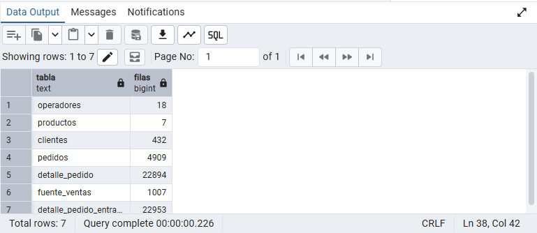

Obtengo los siete conteos previstos: 18 operadores, 7 productos, 18 clientes, 216 pedidos, 1.007 detalles, 1.007 registros fuente y 1.010 filas de entrada.

## 3. Limpieza y transformación

Introduzco ocho precios nulos y tres duplicados exactos exclusivamente en `detalle_pedido_entrada` para demostrar el tratamiento de estas incidencias. Mantengo intacta la fuente real y registro las alteraciones en `datos/incidencias_simuladas.csv`.

### Tratamiento de duplicados y precios nulos

Utilizo `DISTINCT` para eliminar las copias idénticas y `COALESCE` para recuperar cada precio faltante desde su registro fuente:

```sql
INSERT INTO combustibles.detalle_pedido
SELECT DISTINCT
    e.id_detalle, e.id_pedido, e.id_producto, e.id_fuente,
    e.cantidad,
    COALESCE(e.precio_unitario_ars, f.precio_promedio_con_impuestos_ars),
    e.origen
FROM combustibles.detalle_pedido_entrada e
JOIN combustibles.fuente_ventas f ON f.id_fuente = e.id_fuente;
```

Recupero el precio del mismo registro porque es la referencia asignada al pedido por diseño. Esto evita introducir un cero o un promedio ajeno a la operación. Incluyo esta transformación en la carga inicial.

Para comparar la entrada con el detalle limpio, ejecuto:

```sql
SELECT
    'Entrada antes de limpiar' AS etapa,
    COUNT(*) AS filas,
    COUNT(*) - COUNT(DISTINCT id_detalle) AS filas_repetidas,
    COUNT(*) FILTER (WHERE precio_unitario_ars IS NULL) AS precios_nulos
FROM combustibles.detalle_pedido_entrada
UNION ALL
SELECT
    'Detalle limpio',
    COUNT(*),
    COUNT(*) - COUNT(DISTINCT id_detalle),
    COUNT(*) FILTER (WHERE precio_unitario_ars IS NULL)
FROM combustibles.detalle_pedido;
```


El resultado confirma que elimino las tres filas duplicadas y recupero los ocho precios faltantes, conservando los 1.007 detalles previstos.

### Fechas y precisión numérica

Transformo los períodos de origen al tipo `DATE` mediante el primer día del mes. Como los períodos de la muestra están completos, no imputo fechas.

Conservo tres decimales en las cantidades y dos en los precios. Calculo el importe como cantidad × precio y redondeo para su presentación, evitando introducir diferencias en la conciliación.

### Conciliación con la fuente

Comparo las cantidades y los importes de cada registro fuente con los de su detalle de pedido mediante la vista `v_conciliacion`. Compruebo las diferencias con esta consulta:

```sql
SELECT
    COUNT(*) AS registros_comprobados,
    COUNT(*) FILTER (
        WHERE diferencia_cantidad <> 0
           OR diferencia_importe_ars <> 0
    ) AS registros_con_diferencias
FROM combustibles.v_conciliacion;
```


Obtengo **1.007 registros comprobados y 0 con diferencias**. Esto confirma que la transformación conserva las cantidades y los importes de referencia de los registros incluidos.

Los totales del dataset son **93.213.130 litros de combustibles líquidos**, **8.638.800,20 m³ de GNC** y **141.717.574.607,79 ARS de referencia**. Mantengo separadas las dos unidades de volumen.

### Validez y cobertura de las fechas

Compruebo que los pedidos pertenezcan a 2025 y utilicen el primer día del mes como representación del período.

```sql
SELECT COUNT(*) FILTER (WHERE fecha IS NULL) AS fechas_nulas,
       COUNT(*) FILTER (WHERE fecha < DATE '2025-01-01'
           OR fecha >= DATE '2026-01-01' OR EXTRACT(DAY FROM fecha) <> 1) AS fechas_invalidas,
       COUNT(DISTINCT fecha) AS meses
FROM combustibles.pedidos;
```

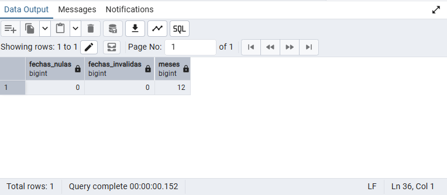

Obtengo 0 fechas nulas, 0 inválidas y 12 meses distintos.

### Unicidad del pedido mensual

Agrupo los pedidos por cliente y mes para detectar grupos cuya cantidad de pedidos difiera de uno.

```sql
SELECT id_cliente, DATE_TRUNC('month', fecha) AS mes, COUNT(*) AS pedidos
FROM combustibles.pedidos
GROUP BY id_cliente, DATE_TRUNC('month', fecha)
HAVING COUNT(*) <> 1;
```

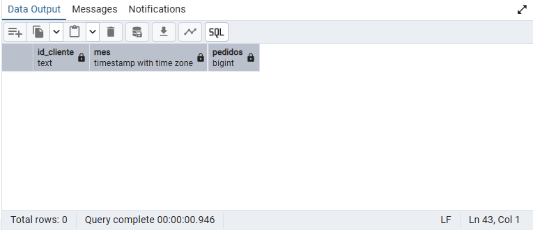

La consulta no devuelve filas: cada combinación de cliente y mes presente tiene un solo pedido.

### Cobertura anual por cliente

Cuento los pedidos de cada cliente mediante LEFT JOIN, incluyendo a quienes pudieran no tener pedidos.

```sql
SELECT c.id_cliente, COUNT(p.id_pedido) AS pedidos
FROM combustibles.clientes c LEFT JOIN combustibles.pedidos p USING(id_cliente)
GROUP BY c.id_cliente HAVING COUNT(p.id_pedido) <> 12;
```

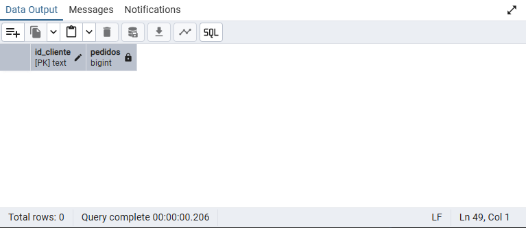

La consulta no devuelve filas: todos los clientes tienen doce pedidos. Junto con los controles de fechas y unicidad, esto confirma un pedido por mes de 2025 para cada cliente.

### Trazabilidad de las relaciones

Relaciono detalles, pedidos, clientes y fuente para comprobar la correspondencia del establecimiento, período y producto.

```sql
SELECT COUNT(*) AS filas_unidas,
       COUNT(*) FILTER (WHERE c.id_operador <> f.id_operador
           OR p.fecha <> f.periodo OR d.id_producto <> f.id_producto) AS errores_trazabilidad
FROM combustibles.detalle_pedido d
JOIN combustibles.pedidos p USING(id_pedido)
JOIN combustibles.clientes c USING(id_cliente)
JOIN combustibles.fuente_ventas f USING(id_fuente);
```

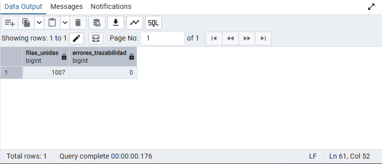

Obtengo 1.007 filas unidas y 0 errores de trazabilidad. El JOIN conserva el número de detalles y las relaciones comprobadas coinciden con la fuente.

### Tipos de datos

Consulto el catálogo de columnas para comprobar los tipos definidos y la precisión numérica.

```sql
SELECT table_name, column_name, data_type, numeric_precision, numeric_scale
FROM information_schema.columns
WHERE table_schema = 'combustibles'
  AND ((table_name = 'pedidos' AND column_name = 'fecha')
    OR (table_name = 'fuente_ventas' AND column_name = 'periodo')
    OR (table_name = 'detalle_pedido' AND column_name IN ('cantidad','precio_unitario_ars')))
ORDER BY table_name, column_name;
```

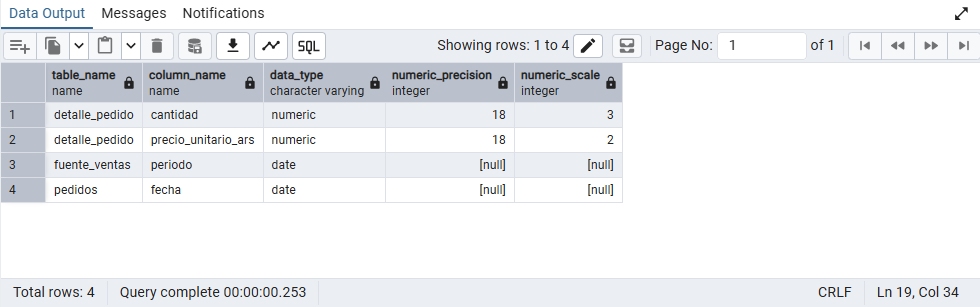

Confirmo DATE en las fechas, NUMERIC(18,3) en la cantidad y NUMERIC(18,2) en el precio. Los valores NULL de precisión y escala en las fechas indican que esos atributos numéricos no corresponden al tipo DATE.

Conservo también los reportes técnicos de [Python Decimal](datos/validacion.json) y [PostgreSQL mediante PGlite](datos/validacion_postgresql.json) como comprobaciones complementarias.

## 4. Análisis de negocio

### 4.1. Cinco clientes con mayor gasto de referencia

Identifico los establecimientos que acumulan el mayor importe de compra simulado durante 2025. Calculo el gasto de referencia como la suma de cantidad × precio y cuento los pedidos con `COUNT(DISTINCT id_pedido)` para evitar contar cada línea de producto como un pedido diferente. Considero los pedidos con estado `Concretado`.

```sql
SELECT
    c.id_cliente,
    c.nombre,
    o.localidad,
    c.provincia,
    COUNT(DISTINCT p.id_pedido) AS cantidad_pedidos,
    ROUND(SUM(d.cantidad * d.precio_unitario_ars), 2) AS gasto_referencia_ars
FROM combustibles.clientes AS c
JOIN combustibles.operadores AS o ON o.id_operador = c.id_operador
JOIN combustibles.pedidos AS p ON p.id_cliente = c.id_cliente
JOIN combustibles.detalle_pedido AS d ON d.id_pedido = p.id_pedido
WHERE p.estado = 'Concretado'
GROUP BY c.id_cliente, c.nombre, o.localidad, c.provincia
ORDER BY SUM(d.cantidad * d.precio_unitario_ars) DESC, c.id_cliente
LIMIT 5;
```

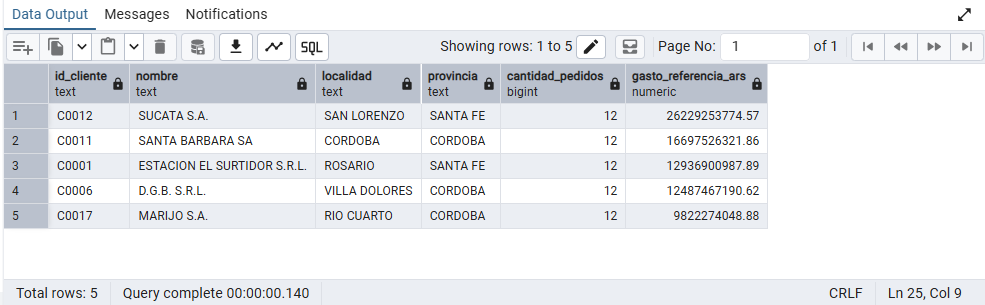


Identifico a **SUCATA S.A.** como la cuenta de mayor importe de referencia, seguida por SANTA BARBARA SA. Los cinco establecimientos se ubican en Santa Fe y Córdoba: dos en la primera provincia y tres en la segunda. Este resultado describe las cuentas seleccionadas y no un ranking provincial del mercado.

Los cinco clientes tienen doce pedidos porque esa frecuencia está fijada en el modelo. Interpreto las diferencias de importe a partir de las cantidades y los precios de los productos adquiridos, sin atribuirlas a una mayor frecuencia ni a fidelidad.

Dentro de la simulación, utilizaría el ranking para priorizar el seguimiento comercial de estas cuentas y profundizar en su composición de compra. El importe por sí solo no permite identificar a los clientes más rentables: no dispongo de costos ni márgenes, y utilizo precios minoristas como referencia.

### 4.2. Evolución mensual de las ventas simuladas

Agrupo los pedidos por mes y calculo el importe total de referencia. Cuento pedidos y clientes distintos para contextualizar cada período.

```sql
SELECT
    DATE_TRUNC('month', p.fecha)::date AS mes,
    COUNT(DISTINCT p.id_pedido) AS cantidad_pedidos,
    COUNT(DISTINCT p.id_cliente) AS cantidad_clientes,
    ROUND(
        SUM(d.cantidad * d.precio_unitario_ars),
        2
    ) AS ventas_referencia_ars
FROM combustibles.pedidos AS p
JOIN combustibles.detalle_pedido AS d
    ON d.id_pedido = p.id_pedido
WHERE p.estado = 'Concretado'
GROUP BY DATE_TRUNC('month', p.fecha)::date
ORDER BY mes;
```

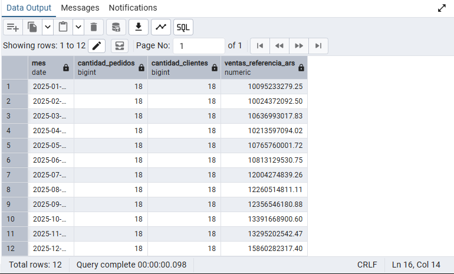


Identifico **diciembre** como el mes de mayor importe, con **15.860.282.317,40 ARS**, y **febrero** como el menor, con **10.024.372.092,50 ARS**. La suma de los doce importes es **141.717.574.607,79 ARS**, coincidente con el total anual del dataset.

Observo una tendencia nominal ascendente, con descensos respecto del mes anterior en febrero, abril y noviembre. Diciembre supera a enero en **57,11 %**, calculado como `(importe_diciembre / importe_enero - 1) * 100`.

En cada mes cuento 18 pedidos y 18 clientes, de acuerdo con la frecuencia establecida en el modelo. Por eso, las variaciones del importe no se explican por incorporar más cuentas o registrar más pedidos. La consulta combina cantidades, precios y composición por productos; no permite separar sus efectos ni demostrar crecimiento real del volumen.

Utilizaría esta evolución para identificar períodos que requieren un análisis adicional de cantidades y precios. Con un solo año de datos no concluyo que el pico de diciembre sea un patrón estacional.

### 4.3. Tres combustibles líquidos menos vendidos

Comparo el volumen acumulado de los productos medidos en litros y selecciono los tres de menor cantidad. Excluyo GNC de este ranking porque su volumen está expresado en m³; mantengo esa unidad separada.

```sql
SELECT
    pr.id_producto,
    pr.nombre_original AS producto,
    pr.categoria,
    SUM(d.cantidad) AS litros_vendidos
FROM combustibles.productos AS pr
JOIN combustibles.detalle_pedido AS d
    ON d.id_producto = pr.id_producto
JOIN combustibles.pedidos AS p
    ON p.id_pedido = d.id_pedido
WHERE p.estado = 'Concretado'
  AND pr.unidad_venta = 'L'
GROUP BY
    pr.id_producto,
    pr.nombre_original,
    pr.categoria
ORDER BY litros_vendidos ASC, pr.id_producto
LIMIT 3;
```

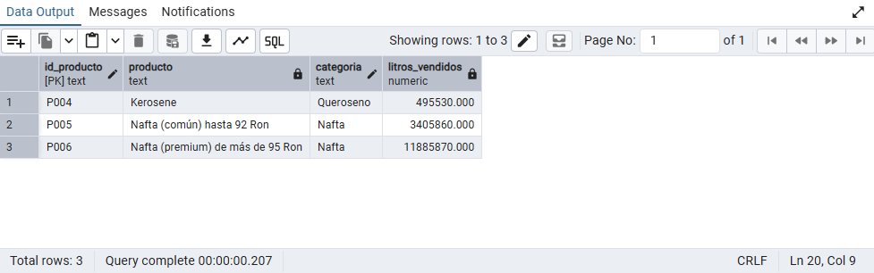


Identifico al queroseno como el producto de menor volumen de la cartera, seguido por la nafta común y la nafta premium. Comparo litros acumulados durante 2025, por lo que este orden no representa un ranking de importes ni de rentabilidad.

Utilizaría este resultado para revisar la cobertura comercial de estos productos: cuántos establecimientos los compran y durante cuántos meses. Un volumen bajo puede estar relacionado con su presencia en menos establecimientos o períodos; esta consulta no demuestra por sí sola una menor demanda entre quienes los ofrecen. No recomendaría retirar un producto sin conocer esa cobertura, sus costos y su función en la oferta.

### 4.4. Ranking de pedidos por categoría

Calculo el importe de cada pedido dentro de cada categoría y utilizo `RANK()` para ordenar los pedidos de mayor a menor importe. Muestro las posiciones uno a tres por categoría para comparar las operaciones de mayor valor.

La unidad de análisis es **pedido y categoría**: si un pedido incluye nafta y gasoil, aparece en ambos rankings con el importe correspondiente a cada categoría. Comparo importes en ARS, por lo que incluyo GNC sin sumar sus m³ a los litros.

```sql
WITH importes_por_categoria AS (
    SELECT
        pr.categoria,
        p.id_pedido,
        p.fecha,
        c.id_cliente,
        c.nombre AS cliente,
        SUM(d.cantidad * d.precio_unitario_ars) AS importe_categoria
    FROM combustibles.pedidos AS p
    JOIN combustibles.clientes AS c
        ON c.id_cliente = p.id_cliente
    JOIN combustibles.detalle_pedido AS d
        ON d.id_pedido = p.id_pedido
    JOIN combustibles.productos AS pr
        ON pr.id_producto = d.id_producto
    WHERE p.estado = 'Concretado'
    GROUP BY pr.categoria, p.id_pedido, p.fecha, c.id_cliente, c.nombre
),
ranking AS (
    SELECT
        *,
        RANK() OVER (
            PARTITION BY categoria
            ORDER BY importe_categoria DESC
        ) AS posicion
    FROM importes_por_categoria
)
SELECT
    categoria,
    posicion,
    id_pedido,
    fecha,
    id_cliente,
    cliente,
    ROUND(importe_categoria, 2) AS importe_referencia_ars
FROM ranking
WHERE posicion <= 3
ORDER BY categoria, posicion, id_pedido;
```

Clasifico por el importe sin redondear y redondeo únicamente para mostrarlo. Los empates comparten posición y generan saltos en la siguiente; el filtro puede devolver más de tres filas por categoría si hay empates. El identificador del pedido ordena la presentación sin romper esos empates.

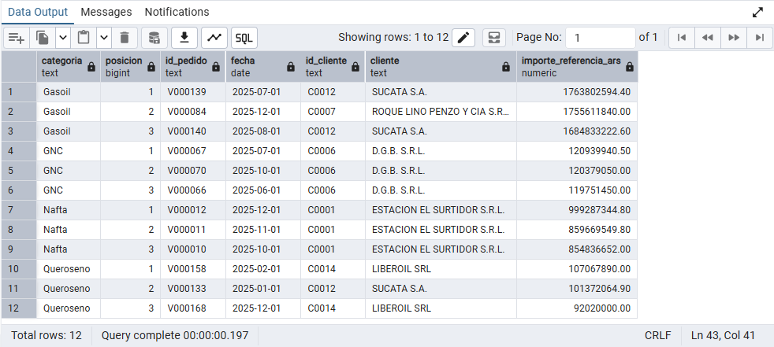

Obtengo tres posiciones por cada una de las cuatro categorías, sin empates en las posiciones mostradas. Identifico los pedidos que encabezan cada ranking:

- **Gasoil:** pedido V000139, de SUCATA S.A., correspondiente a julio, con **1.763.802.594,40 ARS**.
- **GNC:** pedido V000067, de D.G.B. S.R.L., correspondiente a julio, con **120.939.940,50 ARS**.
- **Nafta:** pedido V000012, de ESTACION EL SURTIDOR S.R.L., correspondiente a diciembre, con **999.287.344,80 ARS**.
- **Queroseno:** pedido V000158, de LIBEROIL SRL, correspondiente a febrero, con **107.067.890,00 ARS**.

Observo que D.G.B. S.R.L. ocupa las tres primeras posiciones de GNC y ESTACION EL SURTIDOR S.R.L. las tres de nafta, mediante pedidos de meses diferentes. Esto destaca operaciones de estas cuentas dentro de cada categoría, pero no mide su participación en el importe anual total.

Utilizaría el ranking para seleccionar pedidos cuyo volumen y composición conviene revisar con mayor detalle. Cada importe corresponde únicamente a la categoría indicada; no representa necesariamente el importe completo del pedido ni permite inferir rentabilidad.

### 4.5. Concentración del importe en los cinco principales clientes

Calculo qué porcentaje del importe total de la cartera corresponde a los cinco clientes de mayor gasto de referencia. Selecciono exactamente cinco cuentas con el mismo desempate por identificador utilizado en el top 5. La métrica es `importe_top_5 / importe_total * 100`.

```sql
WITH gasto_por_cliente AS (
    SELECT
        p.id_cliente,
        SUM(d.cantidad * d.precio_unitario_ars) AS importe
    FROM combustibles.pedidos AS p
    JOIN combustibles.detalle_pedido AS d
        ON d.id_pedido = p.id_pedido
    WHERE p.estado = 'Concretado'
    GROUP BY p.id_cliente
),
clientes_ordenados AS (
    SELECT
        id_cliente,
        importe,
        ROW_NUMBER() OVER (
            ORDER BY importe DESC, id_cliente
        ) AS posicion
    FROM gasto_por_cliente
)
SELECT
    ROUND(SUM(importe) FILTER (WHERE posicion <= 5), 2)
        AS importe_top_5_ars,
    ROUND(SUM(importe), 2) AS importe_total_ars,
    ROUND(
        100.0 * SUM(importe) FILTER (WHERE posicion <= 5)
        / NULLIF(SUM(importe), 0),
        2
    ) AS participacion_top_5_pct
FROM clientes_ordenados;
```

Uso `ROW_NUMBER()` para numerar las cuentas y `FILTER` para sumar las cinco primeras sin excluir a las demás del total. `NULLIF` evita dividir por cero. Mantengo los importes sin redondear durante el cálculo del porcentaje y redondeo la presentación.

La consulta está preparada; aún no incorporo su resultado ni una conclusión sobre la concentración de la cartera.


## 5. Límites de interpretación

Delimito las conclusiones a los establecimientos seleccionados y al período 2025. Considero el efecto conjunto de cantidades, precios y composición por productos al interpretar los importes.

No extrapolo la muestra al país ni interpreto una variación nominal como crecimiento real ajustado por inflación. Tampoco calculo rentabilidad, porque no dispongo de costos de compra del mayorista.

## Archivos y reproducción

| Archivo | Contenido |
| --- | --- |
| [estructura.sql](estructura.sql) | Tablas, inserciones, limpieza y vistas |
| [analisis.sql](analisis.sql) | Consultas de negocio comentadas |
| [validaciones.sql](validaciones.sql) | Consultas de control de carga, limpieza, conciliación y relaciones |
| [datos/README.md](datos/README.md) | Fuente, selección y metodología del dataset |
| [datos/diccionario.md](datos/diccionario.md) | Definición de campos, relaciones y unidades |
| [datos/generar_dataset.py](datos/generar_dataset.py) | Generación determinista de los datos derivados |
| [datos/sha256_csv.json](datos/sha256_csv.json) | Huellas de integridad de los CSV |
| [imagenes/](imagenes/) | Resultados de las consultas en pgAdmin |

Para reproducir la base, utilizo una base vacía llamada `capstone_project` y ejecuto completo `estructura.sql`. El archivo contiene las inserciones y la limpieza en una transacción, por lo que no requiere importar los CSV por separado. Desde la raíz del repositorio, puedo cargarlo con:

```bash
psql -d capstone_project -v ON_ERROR_STOP=1 -f estructura.sql
```

Para regenerar los datos derivados, utilizo Python 3.10 o superior, sin dependencias externas:

```bash
python3 datos/generar_dataset.py
```

El generador utiliza la muestra congelada `datos/fuente_original.csv` y reemplaza los derivados y `estructura.sql`. No descarga novedades ni repite la selección desde Access. La validación PostgreSQL se realiza por separado.

Mantengo la atribución de la fuente pública y no asigno una licencia nueva a los datos de terceros.
