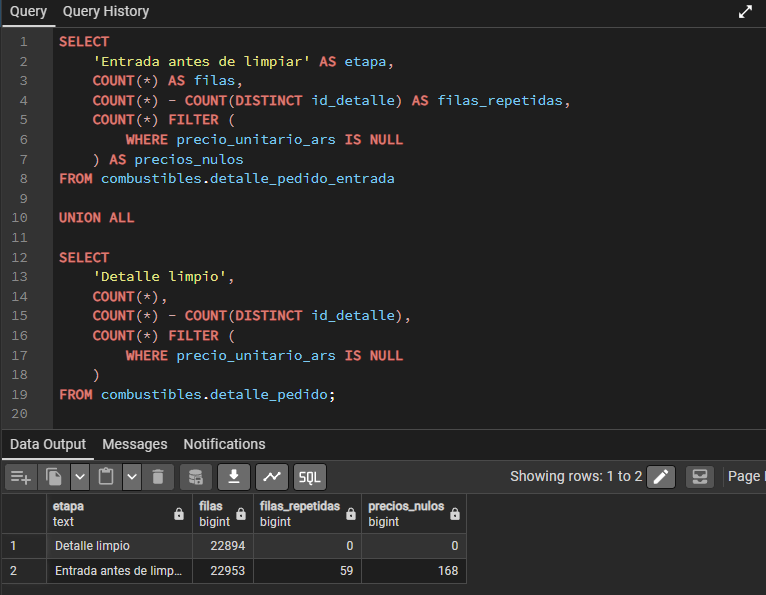
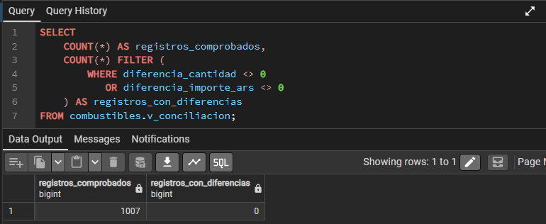

# Análisis de combustibles con PostgreSQL

Proyecto final de Coderhouse. Se construye un caso comercial educativo con datos públicos de combustibles de Argentina y transacciones simuladas, conservando la trazabilidad hasta los registros mensuales de origen.

**Publicación parcial:** los CSV y `estructura.sql` están pendientes de autorización para publicar registros de operadores con nombres y CUIT. Los conteos y procedimientos siguientes describen el dataset preparado y probado; todavía no puede reproducirse la carga solamente con este repositorio.

**Estado:** preparación y limpieza documentadas (pasos 1–3). Análisis e interpretación en desarrollo (pasos 4–5).

## 1. Definición del problema

Una red comercial ficticia necesita conocer cómo se distribuyen sus ventas entre clientes, meses y productos para identificar concentración de ingresos y diferencias de demanda. El objetivo es construir una base relacional y responder estas preguntas con SQL:

| Pregunta | Métrica y criterio |
| --- | --- |
| ¿Cuáles son los cinco clientes con mayor gasto? | Suma de cantidad × precio por cliente. |
| ¿Cómo evolucionan las ventas mensuales? | Importe de referencia agrupado por mes. |
| ¿Cuáles son los tres productos menos vendidos? | Volumen en litros entre los seis combustibles líquidos; GNC se estudia aparte. |
| ¿Qué pedidos tienen mayor importe dentro de cada categoría? | Importe del pedido correspondiente a esa categoría; ranking con `RANK()`. |
| ¿Qué porcentaje del importe concentran los cinco principales clientes? | Importe del top 5 / importe total × 100. |
| ¿Cómo evoluciona el precio ponderado de cada producto? | Suma de cantidad × precio / suma de cantidad, por producto y mes. |

Los importes son estimaciones nominales en ARS con impuestos, calculadas a precios promedio mensuales. No representan facturación auditada, rentabilidad ni valores ajustados por inflación. Los rankings de compradores y pedidos describen la simulación.

### Alcance y procedencia

Se usa una muestra minorista de 2025: 18 establecimientos, tres por provincia, en Buenos Aires, Chaco, Córdoba, Corrientes, Misiones y Santa Fe. No es una muestra representativa del mercado nacional. El archivo mayorista aportado inicialmente no integra este dataset.

Los operadores, productos, volúmenes y precios mensuales proceden de la base pública `precios_eess_2025_en_adelante.accdb`, tabla `public_vi_access_eess_2025_en_adelante`. Los clientes compradores, pedidos, fechas diarias y estado `Concretado` son ficticios. El operador representa el establecimiento de referencia; los clientes son entidades separadas. La bandera es la marca declarada y no acredita una franquicia.

La selección, los filtros, las exclusiones y el algoritmo están documentados en la [metodología del dataset](datos/README.md). La fuente original es el [conjunto público de precios y volúmenes de EESS](https://datos.gob.ar/ar/dataset/energia-precios-volumenes-eess---resolucion-110404).

### Unidades

El volumen de origen se conserva en m³. Para combustibles líquidos se convierte a litros (`m³ × 1.000`), con precio en ARS/L. Para GNC se mantiene m³ y ARS/m³. **No se suman litros y m³ en una misma métrica de volumen.** Las categorías derivadas son Nafta, Gasoil, Queroseno y GNC. La justificación y las referencias de unidades están en la metodología.

## 2. Preparación y carga

Se trabajó con PostgreSQL desde pgAdmin. El archivo `estructura.sql` crea el esquema `combustibles`, define las tablas, carga los datos y ejecuta la limpieza dentro de una transacción. Los `INSERT` están incluidos: no es necesario importar cada CSV manualmente.

### Modelo de datos

Las cuatro tablas comerciales son `clientes`, `productos`, `pedidos` y `detalle_pedido`. Se agregan `operadores`, `fuente_ventas` y `detalle_pedido_entrada` para conservar el origen y auditar la transformación.

| Tabla | Función | Filas esperadas |
| --- | --- | ---: |
| `operadores` | Establecimientos de referencia | 18 |
| `productos` | Productos, categorías y unidades | 7 |
| `clientes` | Compradores ficticios | 432 |
| `pedidos` | Cabeceras con cliente, operador, fecha y estado | 4.909 |
| `detalle_pedido` | Productos, cantidades, precios y vínculo al origen | 22.894 |
| `fuente_ventas` | Registros mensuales reales seleccionados | 1.007 |
| `detalle_pedido_entrada` | Entrada con incidencias controladas | 22.953 |

Cada pedido pertenece a un cliente y a un operador. Cada detalle pertenece a un pedido, un producto y un registro fuente. Se utilizan claves primarias y foráneas, restricciones de cantidades y precios positivos, `DATE` para fechas y `NUMERIC` para cantidades e importes. Véase el [diccionario de datos](datos/diccionario.md).

### Cómo reproducir la carga

1. Crear una base de datos vacía en PostgreSQL y abrir su Query Tool en pgAdmin.
2. Abrir y ejecutar completo `estructura.sql`. El script crea el esquema; debe ejecutarse una sola vez en esa base, porque no elimina objetos existentes.
3. Actualizar el explorador y comprobar las tablas bajo `Schemas → combustibles → Tables`.
4. Ejecutar [validaciones.sql](validaciones.sql) para revisar conteos, limpieza y conciliación.

Los conteos de la tabla anterior proceden del paquete validado. La carga ya se realizó en pgAdmin y las capturas del paso 3 comprueban la entrada, el detalle limpio y la conciliación. Queda pendiente incorporar una captura del conteo conjunto de todas las tablas.

Los CSV están preparados y su publicación queda pendiente. El [generador](datos/generar_dataset.py) usa la semilla `20250915`. Se puede ejecutar desde la raíz con `python3 datos/generar_dataset.py`; regenera los archivos derivados y `estructura.sql`. La extracción y selección previa de la base Access se documentan por separado y no se repiten al ejecutar este generador.

## 3. Limpieza y transformación

Se conserva una entrada de práctica con errores introducidos deliberadamente. No son problemas atribuidos a la fuente pública. Se generaron 167 precios nulos en detalles distintos y 59 filas duplicadas; una de estas repite un precio nulo, por lo que la entrada contiene 168 celdas de precio nulas.

La carga del detalle limpio aplica `DISTINCT` para quitar duplicados exactos y `COALESCE` para recuperar el precio mensual del mismo registro fuente:

```sql
INSERT INTO combustibles.detalle_pedido
SELECT DISTINCT
    e.id_detalle, e.id_pedido, e.id_producto, e.id_fuente,
    e.cantidad,
    COALESCE(e.precio_unitario_ars, f.precio_promedio_con_impuestos_ars),
    e.origen
FROM combustibles.detalle_pedido_entrada AS e
JOIN combustibles.fuente_ventas AS f ON f.id_fuente = e.id_fuente;
```

Este bloque ya está incluido en `estructura.sql`; se muestra como explicación, no para volver a ejecutarlo sobre la tabla cargada. La recuperación funciona porque el precio asignado a cada pedido sintético es precisamente el precio de su registro mensual fuente. No se utiliza un promedio general ni se reemplaza por cero.

### Evidencia de limpieza

| Etapa | Filas | Repeticiones de identificador | Precios nulos |
| --- | ---: | ---: | ---: |
| Entrada | 22.953 | 59 | 168 |
| Detalle limpio | 22.894 | 0 | 0 |



El control de repeticiones usa `COUNT(*) - COUNT(DISTINCT id_detalle)`. En este dataset las repeticiones introducidas son duplicados exactos; en otros datos, compartir identificador no implica que toda la fila sea igual.

### Conciliación con el origen

La vista `combustibles.v_conciliacion` compara, para cada registro fuente, su cantidad y su importe de referencia con la suma de los detalles generados. La validación en pgAdmin comprobó **1.007 registros y cero registros con diferencias** de cantidad o importe.



Esto verifica que el reparto sintético conserva los totales de origen. No acredita que los clientes, las fechas diarias o los pedidos sean reales. Los volúmenes conservados son 93.213.130 L de líquidos y 8.638.800,20 m³ de GNC.

Se conservan también las validaciones del paquete: [Python con Decimal](datos/validacion.json) y [ejecución en PGlite, PostgreSQL 18.3](datos/validacion_postgresql.json). Esta última es una comprobación técnica previa, distinta de las capturas de pgAdmin.

## 4. Análisis — en desarrollo

[analisis.sql](analisis.sql) contiene la primera consulta propuesta: cinco clientes por gasto total, combinando `JOIN`, `GROUP BY` y `SUM`. Falta revisar su resultado conjuntamente, documentar la interpretación y desarrollar las consultas restantes, incluidas las funciones de fecha y `RANK()`.

## 5. Comunicación de hallazgos — pendiente

Se incorporarán los resultados, sus interpretaciones, las capturas y las limitaciones a medida que se ejecuten las consultas. La concentración por cliente está condicionada por los pesos del generador; no debe presentarse como un descubrimiento del mercado real.

## Archivos principales

- `estructura.sql`: definición, carga, limpieza y vistas.
- [validaciones.sql](validaciones.sql): controles reproducibles de los pasos 2 y 3.
- [analisis.sql](analisis.sql): consultas de negocio en desarrollo.
- [datos/README.md](datos/README.md): metodología detallada, fuentes y reproducción.
- [datos/diccionario.md](datos/diccionario.md): descripción de campos.
- `datos/sha256_csv.json`: huellas de integridad de los CSV.
- [imagenes](imagenes/): evidencias de ejecución en pgAdmin.
